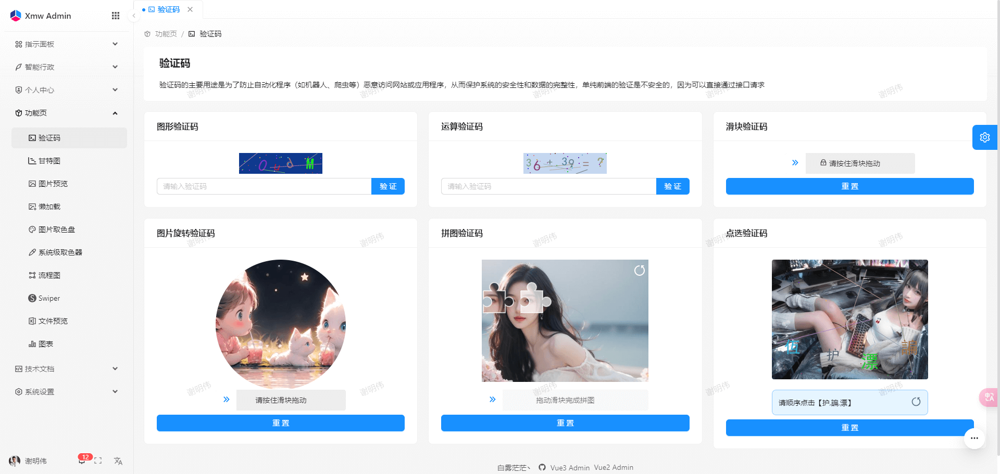
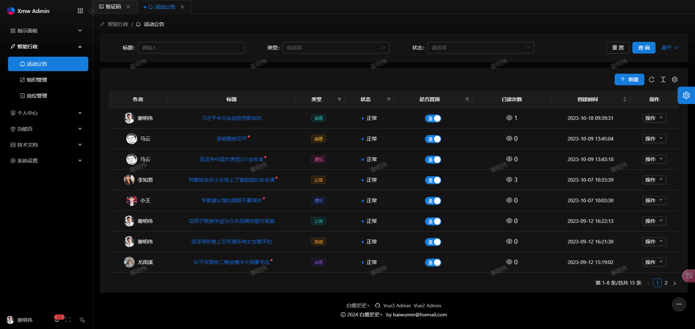
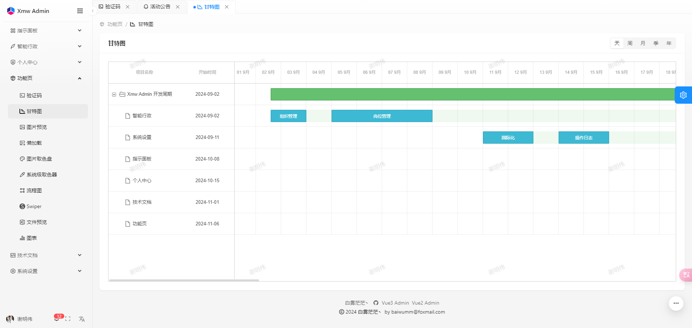
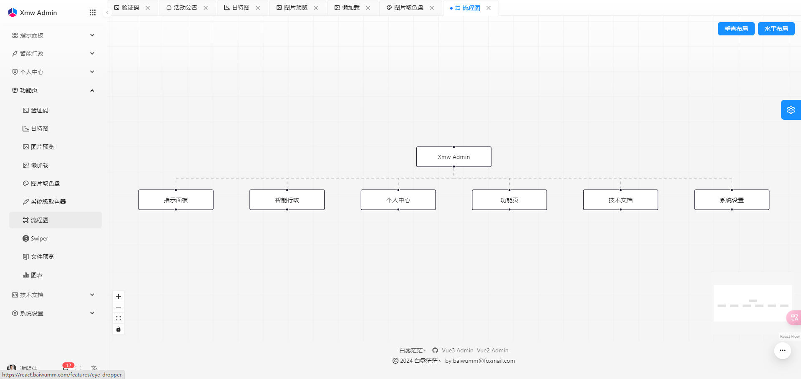
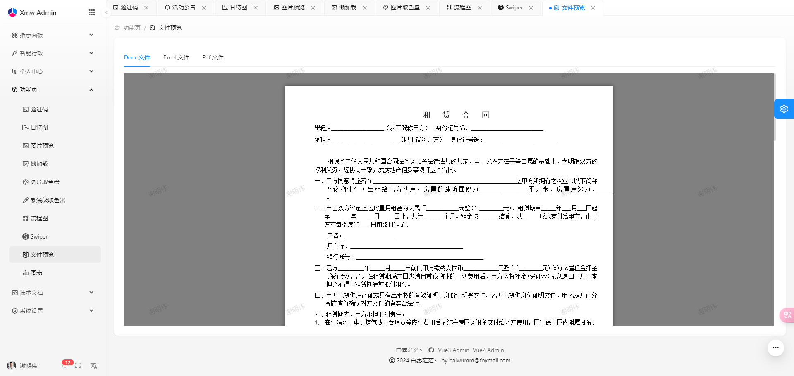
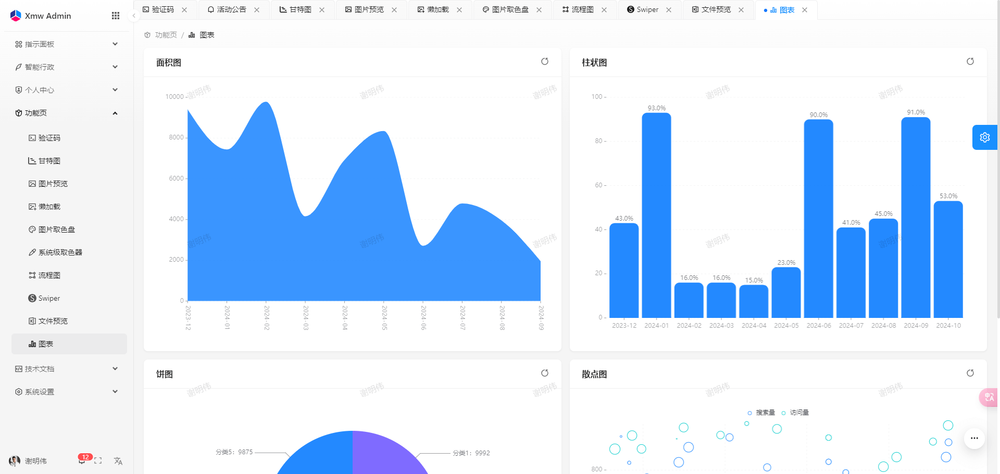
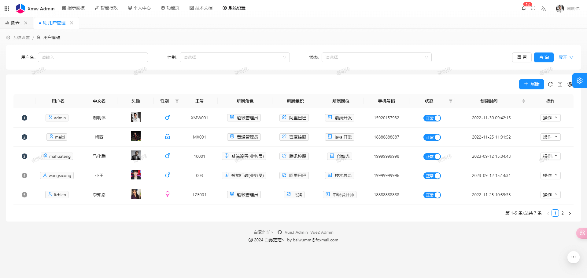
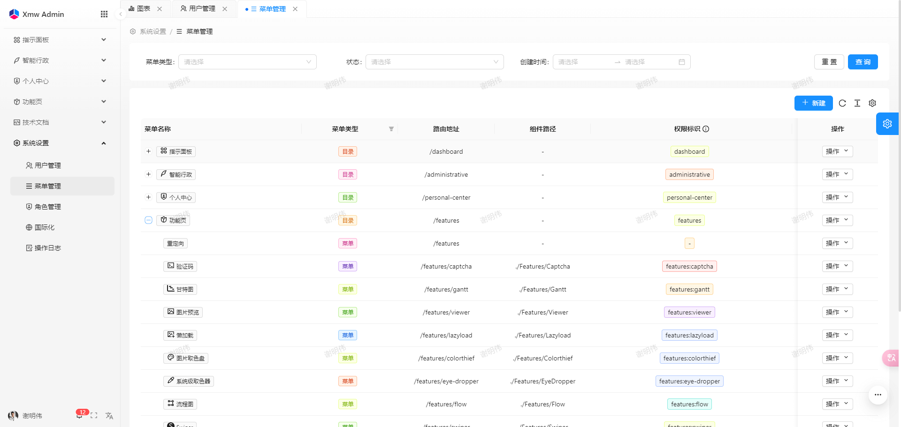
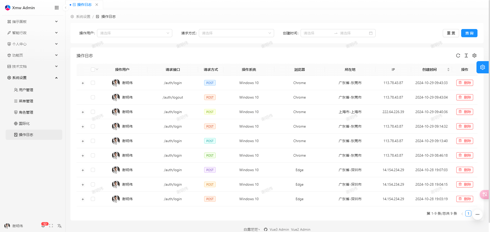

<p align="center"></p>
<h1 align="center">Xmw Admin</h1>
<p align="center">基于 React + Nest 全栈开发的后台系统</p>

## ☘️ 项目简介
- 🍁 前端技术栈： [React](https://react.dev/)、[Ant Design](https://ant.design/)、[Umi](https://umijs.org/)、[TypeScript](https://github.com/microsoft/TypeScript)


- 🍁 后端技术栈： [Nest.js](https://docs.nestjs.cn/)、[Sequelize](https://github.com/sequelize/sequelize/)、[Redis](https://github.com/redis/redis/)、[Mysql](https://www.mysql.com/)

- 🍂 线上预览： https://react.baiwumm.com/

- 🍃 用户名：**admin**，密码：**abc123456**

- [🪹 github 仓库地址](https://github.com/baiwumm/Xmw-Admin/)

- [🪺 码云仓库地址](https://gitee.com/baiwumm/Xmw-Admin/)

- [🍀 Swagger 接口文档](https://react.baiwumm.com/docs)

- ❤️ Star：**如果可以的话，请顺手给个star，表示对作者的鼓励，万分感谢！**

## 🌿 系统功能设计
1. 动态国际化语言配置
2. 记录登录用户的 `CURD` 操作日志
3. 用户和角色权限的一对一映射，根据角色关联的菜单权限生成动态路由菜单
4. 登录用户发布消息公告，后端使用 `SSE` 推送，可登录多个用户查看效果
5. 前端常见的一些实用的业务功能或者一些有趣的效果

## 🌳 环境和依赖
> 推荐本项目使用 [pnpm](https://github.com/pnpm/pnpm/) 包管理工具
- [node](https://nodejs.org/) (Node.js 版本要求 16.x 以上，这里推荐 18.x 及以上)
- [Pnpm](https://github.com/pnpm/pnpm/) (推荐最新版本)
- [Umi](https://umijs.org/)
- [Mysql](https://www.mysql.com/) (Mysql版本为8.x)
- [Redis](https://github.com/redis/redis/)

## 🌴 项目运行
1. 安装 [Mysql](https://www.mysql.com/) 和 [Redis](https://github.com/redis/redis/) 数据库，并导入 `/mysql/xmw_admin.sql` 文件，修改 `/Xmw_server/.development.env` 文件中的数据库配置，这一步要保证成功，不然后端服务起不来
```txt
# ------- Mysql 配置相关 ---------------------
# 数据库 host
DATABASE_HOST =  127.0.0.1
# 端口号
DATABASE_PORT =  3306
# 用户名
DATABASE_NAME =  root
# 密码
DATABASE_PWD =  123456
# 数据库
DATABASE_LIB =  react_baiwumm_com

# ------- Redis 配置相关 ---------------------
# redis 端口号
REDIS_PORT = 6379
# redis hot 
REDIS_HOST = 127.0.0.1
# redis 存储库
REDIS_DB = 0
# redis 密码
REDIS_PASSWORD = ''
```

2. 拉取项目代码
```poswrshell
git clone https://github.com/baiwumm/Xmw-Admin.git
cd Xmw-Admin
// 进入前端
cd Xmw_web
// 进入后端
cd Xmw_server
```

3. 安装依赖
```poswrshell
npm install -g pnpm
pnpm install
```

4. 开发模式运行
```poswrshell
// 前端开发模式启动
pnpm dev
// 后端开发模式启动
pnpm start:dev
```

5. 编译项目
```poswrshell
pnpm build
```

## 🌵 新增路由菜单
1. 在 `Xmw_web/src/pages` 目录下新建 `文件夹/index.tsx` 文件
2. 在 `Xmw_web/config/router` 文件中加入路由配置（系统只做了动态菜单，没有做动态路由，没有找到可行的办法）
3. 在 `Xmw_web/src/utils/enums/index` 文件中加入 `ROUTES` 枚举映射
4. 在 `Xmw_web/src/utils/const/index` 文件中加入 `MenuRemixIconMap` 图标映射
5. 在菜单 `系统管理-国际化-menu` 中添加路由配置
6. 在菜单 `系统管理-菜单管理` 中按照规则添加菜单，可打开多个标签页参考，路由配置参考：[路由](https://umijs.org/docs/guides/routes)
7. 在菜单 `系统管理-角色管理` 中编辑状态中勾选相应的菜单，保存刷新页面，即可看到路由菜单生效

## 🌱 功能模块

```
- 登录 / 注销

- 指示面板
  - 工作台
  - 环境依赖

- 智能行政
  - 活动公告
  - 组织管理
  - 岗位管理
  - 组织架构

- 个人中心
  - 个人信息
  - 个人设置

- 功能页
  - 验证码
  - 甘特图
  - 图片预览
  - 懒加载
  - 图片取色盘
  - 系统级取色器
  - 流程图
  - Swiper
  - 文件预览
  - 图表

- 技术文档
  - React文档
  - Nest文档
  - And-design文档
  - Umi文档

- 系统设置
  - 用户管理
  - 菜单管理
  - 角色管理
  - 国际化
  - 操作日志

```

## 🪴 演示图

|  |  |
| ------------- | ------------- |
|  |  |
|  |  |
|  |  |
|  |  |
|  |  |
|  |  |

## 🍄 总结
1. 本项目没有经过严格的测试，有可能存在一定的 `Bug`。
2. 本项目仅供学习交流使用，请勿用于商业用途。
3. 欢迎提交 [Issues](https://github.com/baiwumm/Xmw-Admin/issues) 和 [PR](https://github.com/baiwumm/Xmw-Admin/pulls)，一起完善本项目。

## ⭐ Star History

[](https://star-history.com/#baiwumm/Xmw-Admin&Date)